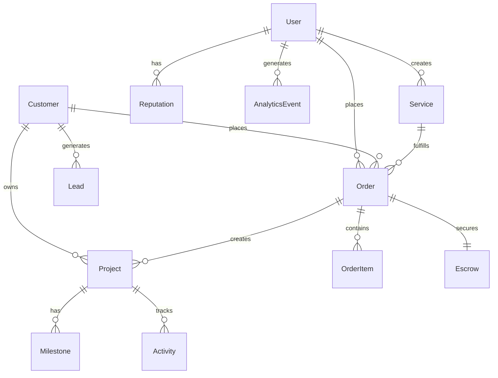
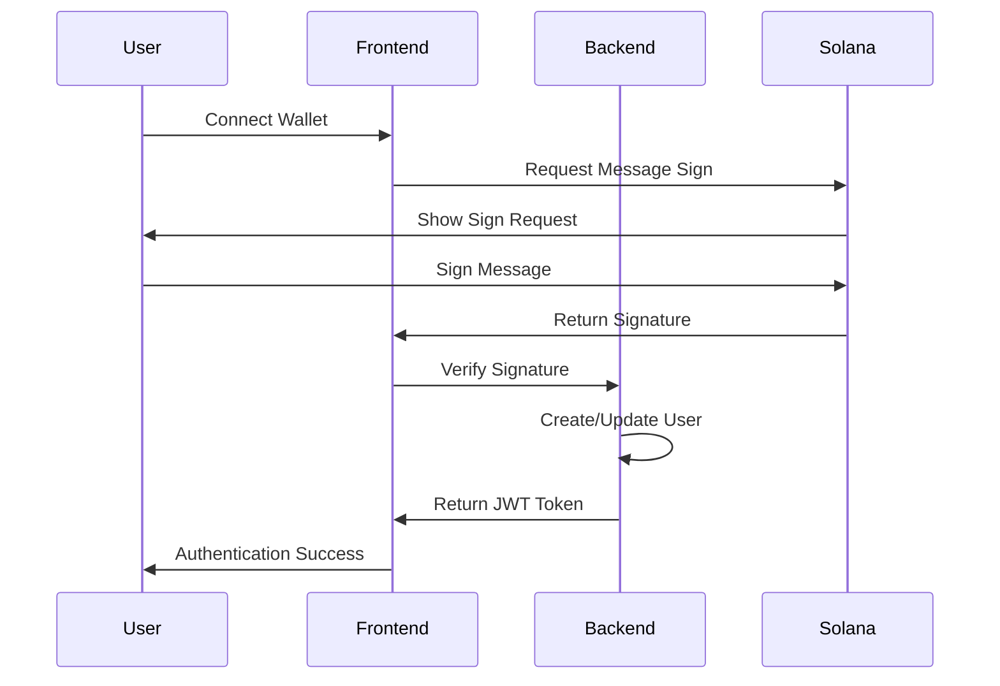

# Tree of Life Agency - System Architecture

## Overview

The Tree of Life Agency platform is a comprehensive service-selling marketplace built on **Solana blockchain**, combining traditional CRM functionality with decentralized marketplace features. The platform enables secure, trustless transactions between clients and service providers through smart contract escrow systems.

## Core Architecture

### Technology Stack

**Frontend:**
- **Framework**: Next.js 14 with App Router
- **Language**: TypeScript for type safety
- **Styling**: Tailwind CSS with organic theme
- **State Management**: React hooks + Context API
- **Blockchain**: Solana Web3.js + ThirdWeb SDK

**Backend:**
- **Runtime**: Node.js with Express.js
- **Database**: PostgreSQL with Prisma ORM
- **Authentication**: JWT + Solana wallet signatures
- **Blockchain**: Solana Web3.js for escrow operations

**Blockchain:**
- **Network**: Solana Mainnet (Chain ID: 101)
- **Smart Contracts**: Anchor framework for escrow programs
- **Wallets**: Phantom, Solflare, Solana Mobile Stack
- **Tokens**: SOL and SPL tokens for payments

## System Components

### 1. User Management System
- **Roles**: Client, Agent, Admin
- **Authentication**: Traditional + Solana wallet
- **Profiles**: Enhanced with reputation and portfolio
- **Permissions**: Role-based access control

### 2. Service Marketplace
- **Categories**: Web Development, Mobile Apps, Consulting
- **Pricing Models**: Fixed Price, Hourly, Subscription
- **Discovery**: Advanced filtering and search
- **Reputation**: On-chain reputation with NFTs

### 3. Escrow System
- **Smart Contracts**: Program-derived addresses (PDAs)
- **Security**: Multi-signature releases
- **Dispute Resolution**: Arbitration mechanisms
- **Transparency**: On-chain transaction tracking

### 4. CRM Integration
- **Lead Management**: Scoring and qualification
- **Project Tracking**: Milestone-based delivery
- **Communication**: Integrated messaging system
- **Analytics**: Performance metrics and reporting

## Database Architecture

### Core Models



### Key Relationships

- **Users** can be Clients (buyers) or Agents (sellers)
- **Services** are created by Agents and purchased by Clients
- **Orders** connect Services with Projects and Escrow
- **Reputation** tracks performance with on-chain NFTs
- **Analytics** provides insights across all activities

## Blockchain Integration

### Solana Program Architecture

```rust
// Escrow Program Structure
#[program]
pub mod tree_of_life_escrow {
    use super::*;
    
    // Initialize escrow with SOL/SPL tokens
    pub fn initialize_escrow(ctx, amount, order_id) -> Result<()> {
        // Create PDA for escrow account
        // Transfer tokens to escrow
        // Set up release conditions
    }
    
    // Release funds to agent
    pub fn release_funds(ctx, order_id) -> Result<()> {
        // Verify project completion
        // Transfer tokens to agent
        // Update escrow status
    }
    
    // Handle disputes
    pub fn dispute_funds(ctx, order_id, reason) -> Result<()> {
        // Lock escrow funds
        // Initiate dispute process
        // Notify arbitration
    }
}
```

### Wallet Integration Flow



## Security Architecture

### Authentication Layers
1. **Wallet Signatures**: Prevent replay attacks
2. **JWT Tokens**: Session management
3. **Role-Based Access**: API-level permissions
4. **Rate Limiting**: Prevent abuse

### Smart Contract Security
1. **Access Control**: PDA-based permissions
2. **Reentrancy Protection**: State validation
3. **Input Validation**: Bounds and type checking
4. **Emergency Pauses**: Circuit breaker patterns

### Data Protection
1. **Encryption**: Sensitive data encryption
2. **Audit Logging**: Complete transaction history
3. **Backup Systems**: Multi-region redundancy
4. **Compliance**: GDPR and data protection

## Performance Optimization

### Frontend Optimizations
- **Lazy Loading**: Wallet adapters and heavy components
- **Caching**: React Query for API responses
- **Code Splitting**: Route-based bundle optimization
- **Image Optimization**: Next.js Image component

### Backend Optimizations
- **Database Indexing**: Optimized query performance
- **Caching**: Redis for session and data caching
- **Connection Pooling**: Database connection management
- **API Rate Limiting**: Prevent overload

### Blockchain Optimizations
- **Batch Transactions**: Multiple instructions per transaction
- **Compute Budget**: Optimize transaction costs
- **Account Compression**: Reduce storage costs
- **RPC Optimization**: Connection pooling and caching

## Deployment Architecture

### Development Environment
- **Local Solana**: Validator for testing
- **PostgreSQL**: Local database instance
- **Redis**: Local caching server
- **Hot Reload**: Frontend development server

### Production Environment
- **Solana Mainnet**: Live blockchain network
- **AWS RDS**: Managed PostgreSQL
- **Redis Cloud**: Managed caching service
- **Vercel**: Frontend hosting and CDN

### CI/CD Pipeline
- **GitHub Actions**: Automated testing and deployment
- **Security Scanning**: Code and dependency analysis
- **Performance Testing**: Load and stress testing
- **Monitoring**: Real-time error tracking

## Monitoring and Analytics

### Application Monitoring
- **Error Tracking**: Sentry for exception monitoring
- **Performance**: Response times and throughput
- **User Analytics**: Usage patterns and behavior
- **Business Metrics**: Revenue and conversion tracking

### Blockchain Monitoring
- **Transaction Tracking**: Success rates and failures
- **Program Events**: Smart contract activity monitoring
- **Network Health**: Solana network status and performance
- **Cost Analysis**: Transaction fees and optimization

### Business Intelligence
- **User Acquisition**: Source and channel analysis
- **Service Performance**: Completion rates and satisfaction
- **Market Trends**: Demand and pricing analysis
- **Financial Reports**: Revenue and profitability tracking

## Future Enhancements

### Advanced Features
- **Cross-Program Calls**: Complex multi-contract workflows
- **NFT Integration**: Service certificates and achievements
- **DAO Governance**: Platform decision-making
- **Layer 2 Solutions**: Enhanced scalability

### Scalability Improvements
- **Program Parallelization**: Concurrent transaction processing
- **State Compression**: Optimized data storage
- **Microservices**: Modular architecture expansion
- **Global Distribution**: Multi-region deployment

### User Experience
- **Mobile Optimization**: Native mobile applications
- **Hardware Wallets**: Ledger and Trezor integration
- **Multi-language**: Internationalization support
- **Accessibility**: WCAG compliance

## Conclusion

The Tree of Life Agency platform represents a comprehensive solution for service marketplaces on Solana, combining the security and transparency of blockchain with the usability of modern web applications. The architecture is designed for scalability, security, and user experience, providing a solid foundation for growth and innovation in the decentralized service economy.
