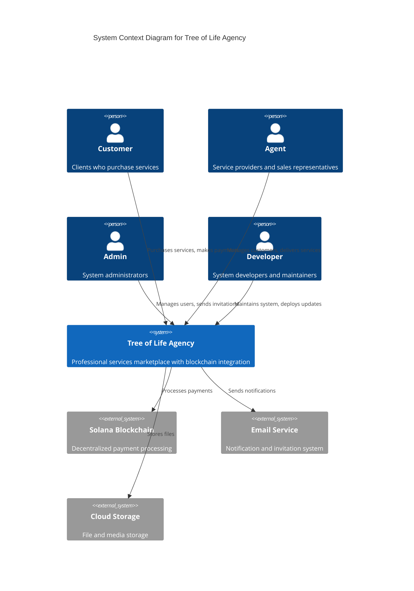
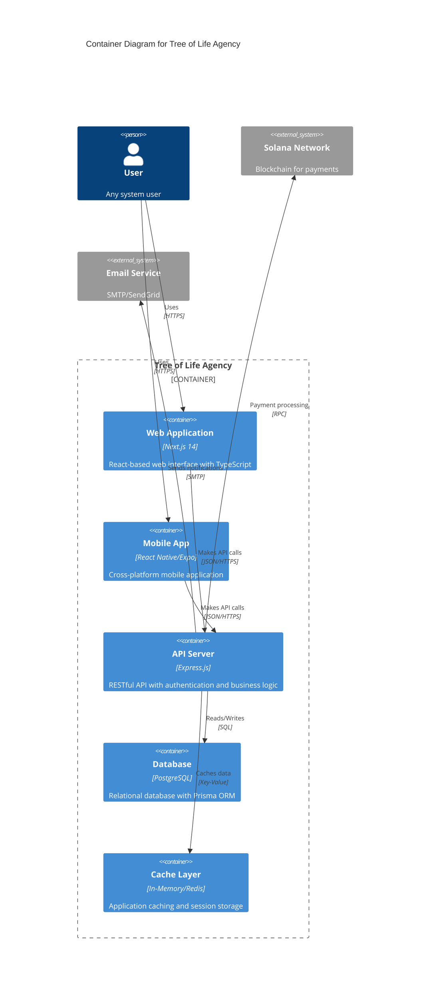
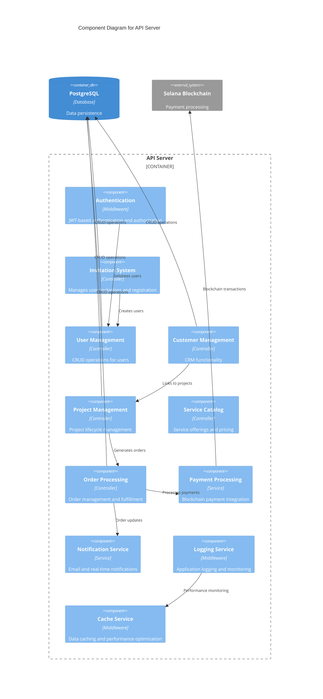
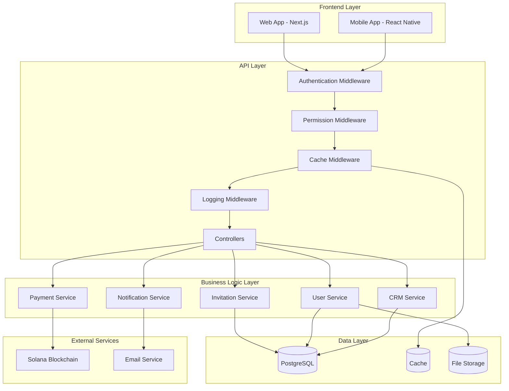
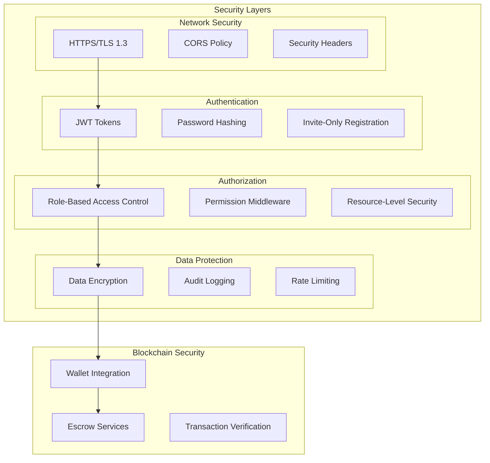
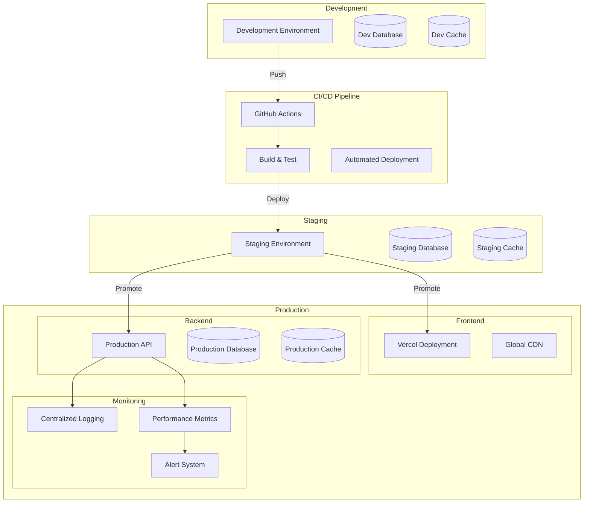

# Tree of Life Agency - System Architecture Overview

## System Context

The Tree of Life Agency is a professional services marketplace built on blockchain technology, featuring an invite-only system with role-based access control.

## Container Architecture

## Component Architecture

## Role-Based Access Control

```mermaid
graph TB
    subgraph "Role Hierarchy"
        DEV[DEVELOPER - Level 5]
        SUPER[SUPER_ADMIN - Level 4]
        ADMIN[ADMIN - Level 3]
        AGENT[AGENT - Level 2]
        CLIENT[CLIENT - Level 1]
    end

    subgraph "Permissions"
        DEV --> |Full System Access| SYS[System Management]
        DEV --> |All Admin Functions| ADM[Admin Functions]
        DEV --> |All Agent Functions| AGT[Agent Functions]
        DEV --> |All Client Functions| CLT[Client Functions]

        SUPER --> |System Configuration| ADM
        SUPER --> |User Management| AGT
        SUPER --> |Service Management| CLT

        ADMIN --> |Invitation Management| INV[Send Invitations]
        ADMIN --> |User Oversight| USR[Manage Users]
        ADMIN --> |Agent Functions| AGT

        AGENT --> |Customer Management| CUS[Manage Customers]
        AGENT --> |Project Management| PRJ[Manage Projects]
        AGENT --> |Lead Management| LED[Manage Leads]

        CLIENT --> |Service Access| SRV[View Services]
        CLIENT --> |Order Management| ORD[Manage Orders]
        CLIENT --> |Profile Management| PRF[Update Profile]
    end
```

## Data Flow Architecture

## Security Architecture

## Deployment Architecture

## Technology Stack

| Layer | Technology | Purpose |
|-------|------------|---------|
| **Frontend** | Next.js 14, React 18, TypeScript 5.0 | Web application with App Router |
| **Mobile** | React Native, Expo | Cross-platform mobile app |
| **Backend** | Express.js, Node.js | RESTful API server |
| **Database** | PostgreSQL, Prisma ORM | Data persistence and modeling |
| **Authentication** | JWT, bcrypt | Secure authentication |
| **Blockchain** | Solana Web3.js | Payment processing |
| **Styling** | Tailwind CSS | Utility-first CSS framework |
| **Testing** | Jest, Playwright | Unit and E2E testing |
| **CI/CD** | GitHub Actions, Vercel | Automated deployment |
| **Monitoring** | Custom logging, Performance tracking | System observability |

## Key Architectural Decisions

### 1. Invite-Only System
- **Decision**: Implement token-based invitation system
- **Rationale**: Ensures controlled access and quality user base
- **Implementation**: 7-day expiring tokens with role assignment

### 2. Role Hierarchy
- **Decision**: Five-tier role system (CLIENT → AGENT → ADMIN → SUPER_ADMIN → DEVELOPER)
- **Rationale**: Granular permission control and clear responsibility separation
- **Implementation**: Hierarchical permissions with resource-level access control

### 3. Blockchain Integration
- **Decision**: Solana blockchain for payments
- **Rationale**: Low fees, fast transactions, growing ecosystem
- **Implementation**: Web3.js integration with escrow services

### 4. Monorepo Structure
- **Decision**: Organized monorepo with apps/, libs/, tools/ structure
- **Rationale**: Code reuse, consistent tooling, easier maintenance
- **Implementation**: Shared types, business logic, and UI components

### 5. TypeScript-First
- **Decision**: Strict TypeScript across all layers
- **Rationale**: Type safety, better developer experience, fewer runtime errors
- **Implementation**: Strict mode enabled, comprehensive type definitions

## Performance Considerations

- **Caching Strategy**: Multi-layer caching (in-memory, Redis, CDN)
- **Database Optimization**: Indexed queries, connection pooling
- **Frontend Optimization**: Code splitting, lazy loading, image optimization
- **API Optimization**: Response compression, rate limiting, request deduplication
- **Monitoring**: Real-time performance tracking and alerting

## Security Considerations

- **Authentication**: JWT with secure storage and rotation
- **Authorization**: Role-based with resource-level permissions
- **Data Protection**: Encryption at rest and in transit
- **Input Validation**: Comprehensive validation using Zod
- **Rate Limiting**: API endpoint protection
- **Audit Logging**: Complete activity tracking
- **Blockchain Security**: Wallet integration with transaction verification
