# System Workflows and Diagrams

## Overview

This document outlines the key workflows and user journeys within the Tree of Life Agency platform, visualized through Mermaid diagrams. These workflows cover the complete lifecycle from user onboarding through service delivery and completion.

## User Onboarding Workflows

### Client Onboarding Flow

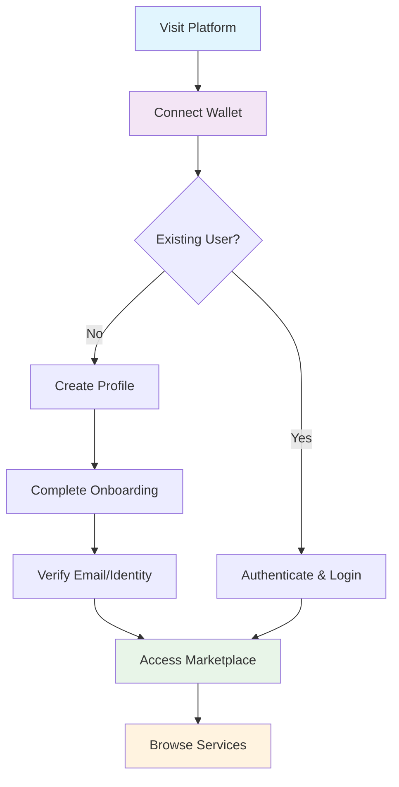

### Agent Onboarding Flow

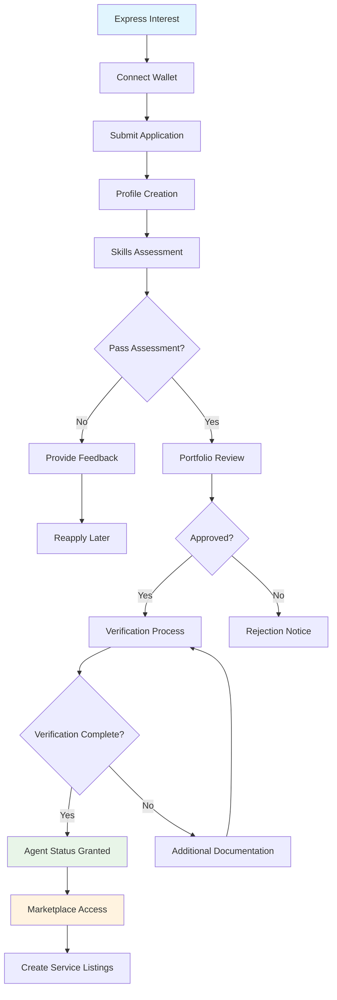

## Service Discovery and Purchase

### Service Browsing Workflow

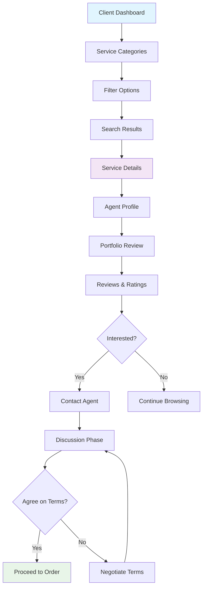

### Order Creation Process

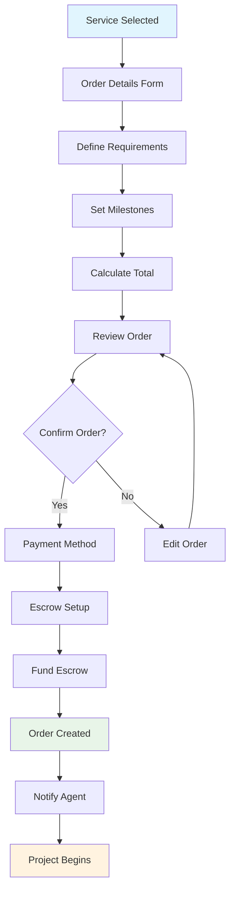

## Project Execution Workflows

### Agile Development Workflow

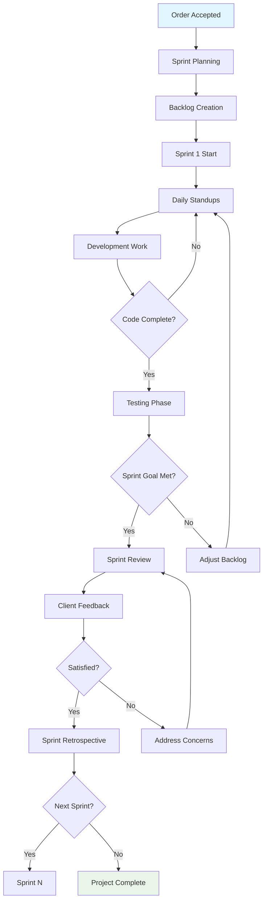

### Milestone-Based Delivery

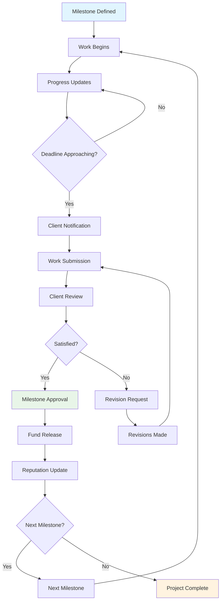

## Payment and Escrow Workflows

### Escrow Fund Management

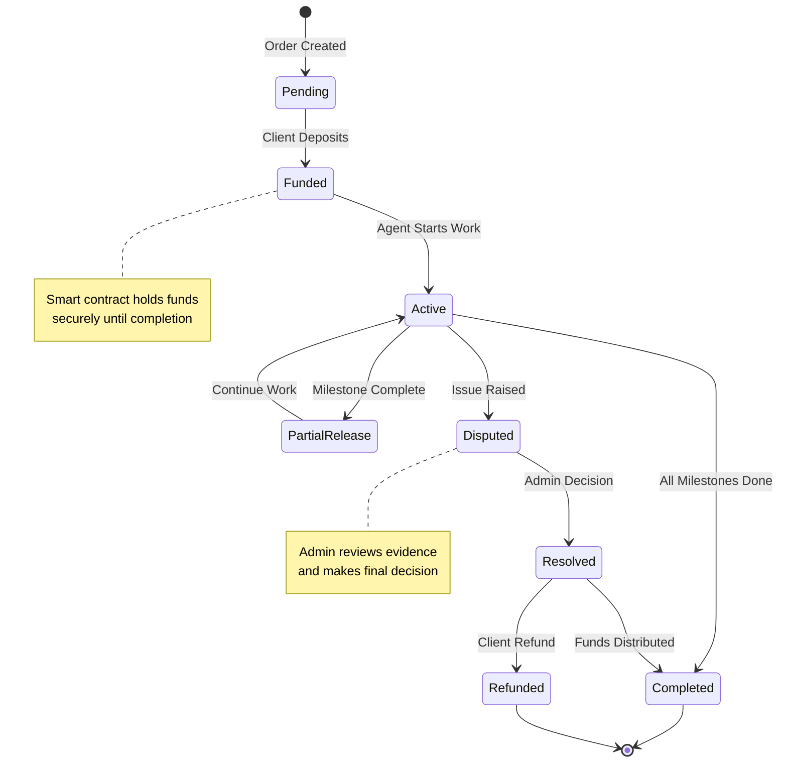

### Smart Contract Interaction Flow

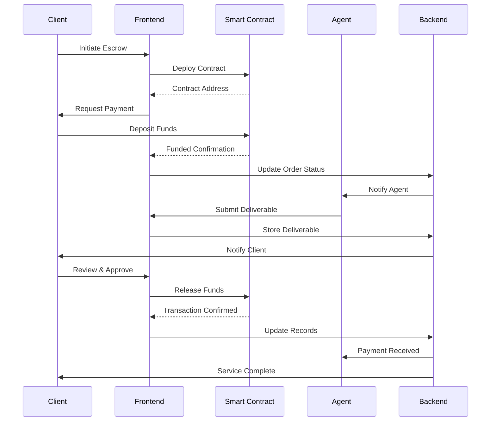

## Reputation and Review System

### Review Submission Workflow

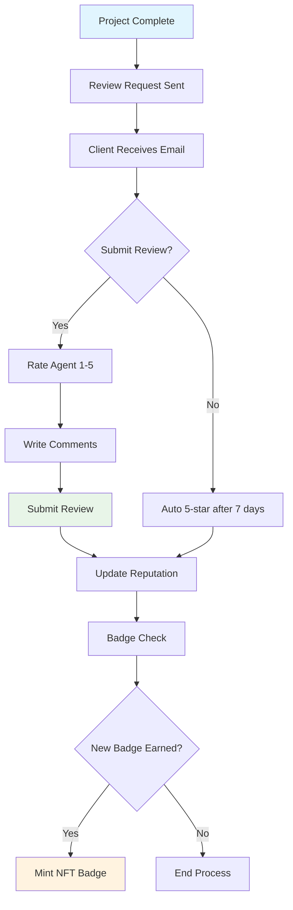

### Reputation Score Calculation

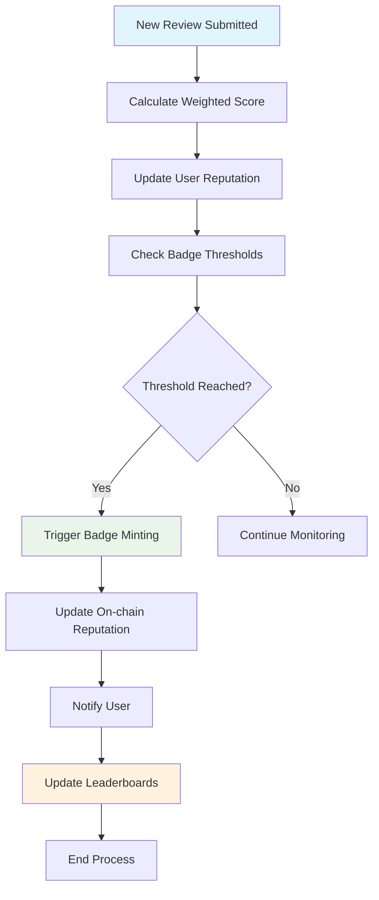

## Administrative Workflows

### Dispute Resolution Process

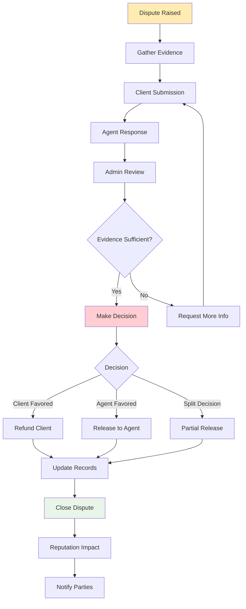

### Agent Verification Workflow

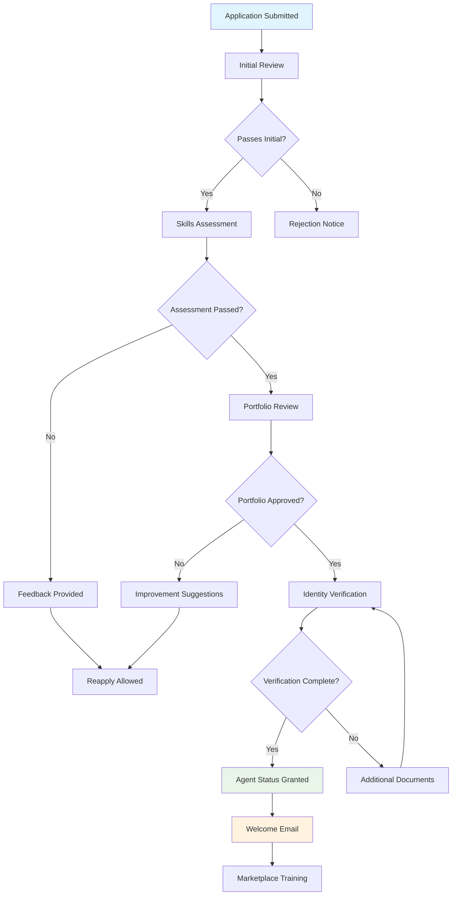

## Analytics and Reporting Workflows

### Real-time Dashboard Updates

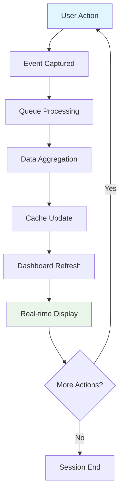

### Automated Report Generation

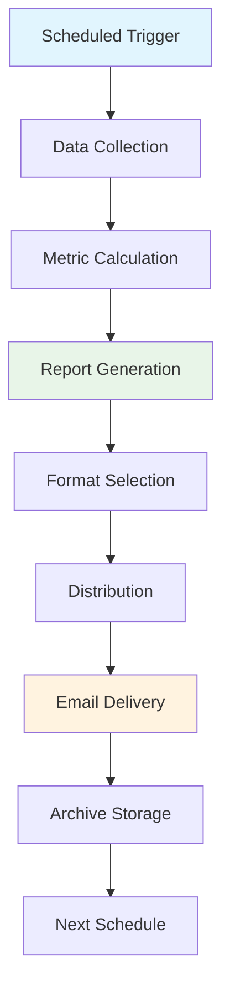

## Error Handling and Recovery

### Transaction Failure Recovery

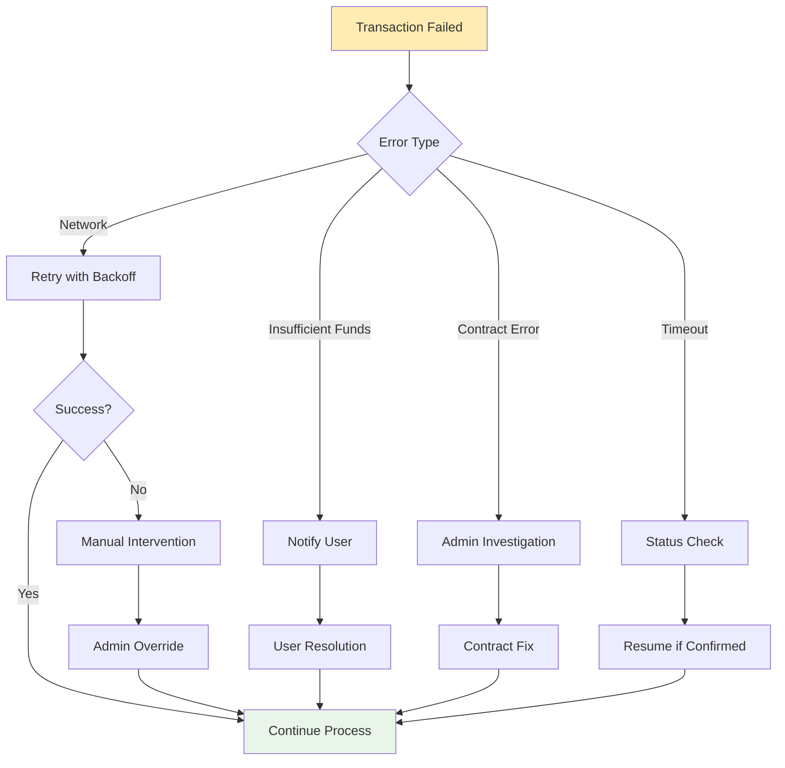

These workflows provide a comprehensive view of the user journeys and system interactions within the Tree of Life Agency platform, ensuring smooth operation and clear user experiences throughout the service delivery process.</target_file>